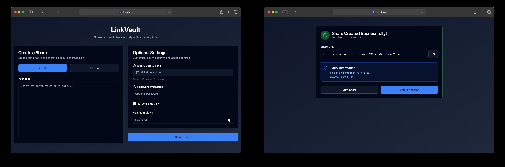

<p align="center">
  
</p>

<h1 align="center">LinkVault</h1>

<p align="center">
A modern, secure file and text sharing platform with expiring links. Built with React, Node.js, Express, and Appwrite.
</p>

<p align="center">
  <a href="#features">Features</a> • 
  <a href="#tech-stack">Tech Stack</a> • 
  <a href="#setup-instructions">Setup</a> • 
  <a href="#api-documentation">API</a> • 
  <a href="#design-decisions">Design Decisions</a> • 
  <a href="#assumptions-and-limitations">Assumptions and Limitations</a> • 
  <a href="#backend-environment-variables">Environment Variables</a> •  
  <a href="#quick-api-tests">Test API</a>
</p>

<p align="center">
  
  
  
  
  
</p>

<p align="center">
  
</p>

---

## Features

### Core Features

- **Text & File Uploads**: Share plain text or any file type (up to 50MB)
- **Unique Shareable Links**: Generate secure, hard-to-guess URLs
- **Automatic Expiry**: Content expires after specified duration (default: 10 minutes)
- **Access Control**: Content only accessible via the exact link
- **Clean UI**: Modern interface built with shadcn/ui components

### Bonus Features

- **Password Protection**: Secure links with optional passwords
- **One-Time View**: Links that self-destruct after first access
- **View Limits**: Set maximum number of views per share
- **Manual Delete**: Delete shares anytime
- **File Type Validation**: Blocks dangerous file types (executables, scripts) for security
- **Background Cleanup**: Automated job for expired content removal
- **Responsive Design**: Works seamlessly on all devices

## Tech Stack

### Frontend

- **React 18** with Vite for fast development
- **Tailwind CSS** for styling
- **shadcn/ui** components for polished UI
- **React Router** for navigation
- **Axios** for API calls
- **date-fns** for date formatting

### Backend

- **Node.js** with Express.js framework
- **Appwrite TablesDB** for database
- **Appwrite Storage** for file uploads
- **Multer** for file upload handling
- **bcrypt** for password hashing
- **node-cron** for scheduled cleanup jobs

## Project Structure

```
linkvault/
├── backend/
│   ├── utils/
│   │   ├── appwrite.js        # Appwrite client config
│   │   ├── shares.js          # API routes
│   │   └── cleanup.js         # Cleanup cron job
│   ├── server.js              # Entry point
│   ├── .env                   # Environment variables
│   ├── .gitignore
│   └── package.json
│
└── frontend/
    ├── src/
    │   ├── components/
    │   │   └── ui/            # shadcn/ui components
    │   ├── lib/
    │   │   └── utils.js       # Utility functions
    │   ├── pages/
    │   │   ├── UploadPage.jsx    # Upload interface
    │   │   ├── ViewPage.jsx      # Share viewing
    │   │   └── SuccessPage.jsx   # Success screen
    │   ├── App.jsx
    │   ├── main.jsx
    │   └── index.css
    ├── .env
    ├── .gitignore
    ├── tailwind.config.js
    ├── vite.config.js
    └── package.json
```

## Setup Instructions
```bash
# Quick Start (Recommended)
Setup .env.local
Directly start the devcontainer, app will auto-build and run

# Manual Start
chmod +x run.sh
./run.sh # Run frontend and backend together
```

This script will:
- Install all dependencies for frontend and backend
- Start the backend server (http://localhost:5001)
- Start the frontend server (http://localhost:5173)
- Handle graceful shutdown on Ctrl+C

### Prerequisites

- Node.js (v18 or higher)
- Appwrite account (cloud.appwrite.io or self-hosted)
- npm or yarn package manager

### Set up Appwrite:
   - Create a project at [cloud.appwrite.io](https://cloud.appwrite.io)
   - Create a TablesDB database and a table named "shares"
   - Create a Storage bucket for file uploads
   - Generate an API key with appropriate permissions
   - Update the `.env` file with your credentials

## API Documentation

### Base URL

```
http://localhost:5001/api
```

### Endpoints

#### 1. Upload Content - **POST** `/upload`

Creates a new share with text or file content.

**Request:**

- Content-Type: `multipart/form-data`

**Body Parameters:**
| Field | Type | Required | Description |
|-------|------|----------|-------------|
| text | string | conditional | Text content (required if no file) |
| file | file | conditional | File upload (required if no text) |
| expiryDate | datetime | optional | ISO 8601 format expiry date |
| password | string | optional | Password protection |
| oneTimeView | boolean | optional | Self-destruct after first view |
| maxViews | number | optional | Maximum view count |

**Blocked File Types:** `.exe`, `.bat`, `.cmd`, `.com`, `.scr`, `.vbs`, `.cpl`, `.msi`, `.sh`, `.bash`, `.zsh`, `.fish` (and corresponding MIME types)

**Response:** `201 Created`

```json
{
  "success": true,
  "shareId": "kA8x9pQ2mL",
  "shareUrl": "http://localhost:5173/share/kA8x9pQ2mL",
  "expiresAt": "2026-02-03T10:00:00.000Z"
}
```

**Error Response:** `400 Bad Request`

```json
{
  "error": "Either text or file must be provided"
}
```

#### 2. Retrieve Share - **GET** `/share/:shareId`

Retrieves share metadata and content.

**Query Parameters:**
| Field | Type | Required | Description |
|-------|------|----------|-------------|
| password | string | conditional | Required if share is password-protected |

**Response:** `200 OK`

```json
{
  "shareId": "kA8x9pQ2mL",
  "contentType": "text",
  "textContent": "Hello world!",
  "expiresAt": "2026-02-03T10:00:00.000Z",
  "createdAt": "2026-02-03T09:50:00.000Z",
  "oneTimeView": false,
  "maxViews": null,
  "currentViews": 1
}
```

**Error Responses:**

- `404 Not Found`: Share doesn't exist
- `410 Gone`: Share has expired
- `401 Unauthorized`: Password required or incorrect
- `403 Forbidden`: Maximum views reached

#### 3. Download File

**GET** `/download/:shareId`

Downloads file content.

**Query Parameters:**
| Field | Type | Required | Description |
|-------|------|----------|-------------|
| password | string | conditional | Required if share is password-protected |

**Response:** `200 OK`

- Downloads file with original filename

**Error Responses:**

- `404 Not Found`: Share or file doesn't exist
- `410 Gone`: Share has expired
- `400 Bad Request`: Share doesn't contain a file
- `401 Unauthorized`: Password required or incorrect

#### 4. Delete Share

**DELETE** `/share/:shareId`

Deletes a share and its associated content.

**Query Parameters:**
| Field | Type | Required | Description |
|-------|------|----------|-------------|
| password | string | conditional | Required if share is password-protected |

**Response:** `200 OK`

```json
{
  "success": true,
  "message": "Share deleted successfully",
  "shareId": "kA8x9pQ2mL"
}
```

**Error Responses:**

- `404 Not Found`: Share doesn't exist
- `401 Unauthorized`: Password required or incorrect
- `500 Server Error`: Deletion failed

#### 5. Health Check

**GET** `/health`

Server health check endpoint.

**Response:** `200 OK`

```json
{
  "status": "ok",
  "timestamp": "2026-02-03T09:44:00.000Z"
}
```

## Design Decisions

### 1. Database Choice: Appwrite TablesDB

**Reasoning:**

- Flexible schema perfect for varying metadata (password, views, etc.)
- Cloud-hosted with automatic scaling
- No infrastructure management required

### 2. File Storage: Appwrite Storage Bucket

**Reasoning:**

- Direct URL generation for downloads
- No need to manage filesystem or S3 separately
- Automatic file cleanup with bucket rules

### 3. Password Hashing: bcrypt

**Reasoning:**

- Industry-standard for password hashing
- Adaptive hashing (protection against future hardware)
- Built-in salting

### 4. Cleanup Strategy: Cron Job

**Approach:** Node-cron scheduled job

- Queries expired shares from TablesDB
- Deletes database records
- Deletes associated files from Appwrite Storage
- Runs every 5 minutes

### 5. Frontend Framework: React + Vite

**Reasoning:**

- Rapid Development
- Modern build tooling
- Component-based architecture
- Large ecosystem
- Paired with shadcn/ui with tailwind CSS

### 6. API Design: RESTful

**Reasoning:**

- Standard HTTP methods and status codes
- Easy to understand and document

## Assumptions and Limitations

### Assumptions

1. **Appwrite Account**: Requires active Appwrite account (free tier available).
2. **Trusted Network**: CORS configured for localhost. Production requires proper CORS configuration.
3. **File Size**: 50MB limit balances usability and server resources.
4. **Expiry**: Default 10-minute expiry assumes typical use case of temporary sharing.

### Limitations

1. **No User Accounts**: Anonymous sharing only (by design for MVP).
2. **No File Scanning**: No antivirus/malware scanning on uploaded files.
3. **No Edit Capability**: Shares are immutable after creation.
4. **No Compression**: Files stored as-is without compression.

## Database Schema

View in `DB_Schema.md`

## Additional Backend Design Notes

- **Password hashing**: bcrypt (10 salt rounds), never stored in plain text.
- **View counting**: incremented after validation; auto-deletes at `maxViews` or when `oneTimeView` is true.
- **Expiry**: enforced on access plus a 5-minute cron cleanup job.
- **File URLs**: generated at upload time and stored in TablesDB; files are publicly readable.
- **Error handling**: consistent HTTP codes (400, 401, 403, 404, 410, 500) with safe error messages.

### Backend Environment Variables

| Variable                 | Description                  | Example                            |
| ------------------------ | ---------------------------- | ---------------------------------- |
| `PORT`                   | Server port                  | `5001`                             |
| `FRONTEND_URL`           | Frontend URL for share links | `http://localhost:5173`            |
| `APPWRITE_ENDPOINT`      | Appwrite API endpoint        | `https://sgp.cloud.appwrite.io/v1` |
| `APPWRITE_PROJECT_ID`    | Appwrite project ID          | `2305039582034892`                 |
| `APPWRITE_API_KEY`       | Appwrite API key             | `304809483243048s`                 |
| `DATABASE_ID`            | Appwrite database ID         | `082342432424042s`                 |
| `TABLE_ID`               | Appwrite table ID            | `shares`                           |
| `BUCKET_ID`              | Appwrite storage bucket ID   | `0923840948324908`                 |
| `MAX_FILE_SIZE`          | Max upload size in bytes     | `10000000`                         |
| `DEFAULT_EXPIRY_MINUTES` | Default expiry time          | `10`                               |

### Quick API Tests

```bash
# Health check
curl http://localhost:5001/health

# Upload text
curl -X POST http://localhost:5001/api/upload \
  -H "Content-Type: application/json" \
  -d '{"text":"Hello World"}'

# Retrieve share (replace ID)
curl http://localhost:5001/api/share/{shareId}

# Upload with password
curl -X POST http://localhost:5001/api/upload \
  -H "Content-Type: application/json" \
  -d '{"text":"Secret","password":"mypass"}'

# Access password-protected share
curl http://localhost:5001/api/share/{shareId}?password=mypass
```

## Author

```bash
Ansh Gupta
M.Tech CSE, IIT Kharagpur

# For Design Lab 2026
```
